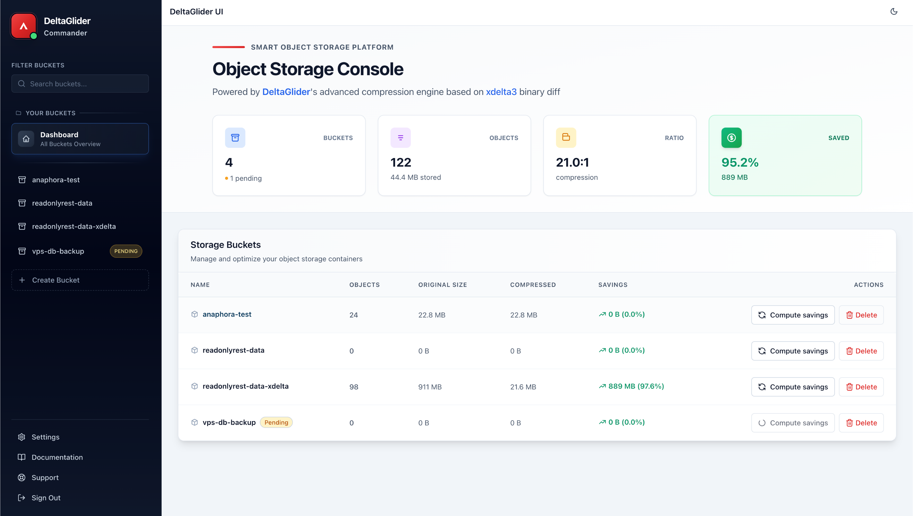

# DeltaGlider Commander



DeltaGlider Commander is a Flask-based backend service with a React frontend that provides a REST API for browsing and managing objects in S3 buckets through the [DeltaGlider SDK](https://github.com/beshu-tech/deltaglider). The application focuses on delta compression and storage optimization.

## Features

- **S3 Object Management**: Browse, download, and upload objects in S3-compatible storage
- **Delta Compression**: Leverages DeltaGlider SDK for efficient storage and transfer
- **Modern Web UI**: React-based frontend with TypeScript and Vite
- **RESTful API**: Comprehensive Flask API with HMAC authentication and rate limiting
- **Docker Support**: Multi-stage Docker builds with automated CI/CD pipeline
- **Performance Optimizations**: Fast metadata retrieval with optional quick-mode listing
- **Security**: Bandit scanning, secure temp directory handling, HMAC-signed download tokens

## Architecture

### Backend (Python/Flask)
- **Layered Architecture**: Clear separation between API, service, and data layers
- **DeltaGlider Integration**: Abstract protocol with S3 and in-memory implementations
- **Dependency Injection**: Centralized configuration and service management
- **HMAC Authentication**: Secure download URLs with time-based tokens

### Frontend (React/TypeScript)
- **Modern Tooling**: Vite, TanStack Router, TanStack Query
- **Type Safety**: Full TypeScript implementation
- **Component Architecture**: Feature-based organization with reusable UI components

## Getting Started

### Prerequisites
- Python 3.8+
- Node.js 18+
- pnpm (for frontend package management)
- Docker and Docker Compose (for local development)

### Development Setup

#### Backend Development

Create a virtual environment and install dependencies:

```bash
python3 -m venv .venv
source .venv/bin/activate
pip install -e .[dev]
```

Start the Flask development server:

```bash
# With TEST_MODE for using test SDK
DGCOMM_HMAC_SECRET=beshutech TEST_MODE=true flask --app src/dgcommander/app.py run --debug --host 0.0.0.0 --port 8000

# Production mode (requires session credentials)
DGCOMM_HMAC_SECRET=beshutech flask --app src/dgcommander/app.py run --debug --host 0.0.0.0 --port 8000
```

Run tests:

```bash
pytest
pytest tests/test_buckets_api.py  # Run specific test file
pytest -k test_name               # Run specific test
```

#### Frontend Development

The frontend uses **runtime API URL detection** - no environment-specific configuration needed!

```bash
cd frontend
pnpm install

# Development server
pnpm dev          # Start dev server at http://localhost:5173

# Production build
pnpm build        # Build for production
pnpm preview      # Preview production build

# Code quality
pnpm typecheck    # TypeScript type checking
pnpm lint         # Run ESLint
pnpm test         # Run tests with Vitest
pnpm format       # Check Prettier formatting
```

#### Smart API URL Detection

The frontend automatically detects its environment at **runtime**:
- **Development** (localhost:5173): API calls go to `http://localhost:8000`
- **Production** (any other host): API calls use relative URLs (`/api/*`)

This means:
- ✅ **Same build works everywhere** - no environment-specific builds needed
- ✅ **No configuration hassle** - works in dev and production automatically
- ✅ **Simple deployment** - just build once and deploy anywhere

The magic happens in `src/lib/config/env.ts` which detects `window.location.hostname` and `window.location.port` at runtime.

#### Full Stack Development

Start both backend and frontend for local development:

```bash
# Terminal 1: Backend
source .venv/bin/activate
DGCOMM_HMAC_SECRET=beshutech flask --app src/dgcommander/app.py run --debug --host 0.0.0.0 --port 8000

# Terminal 2: Frontend
cd frontend
pnpm dev
```

Then:
1. Open http://localhost:5173 in your browser
2. Navigate to Settings
3. Enter your S3/AWS credentials
4. Start browsing your S3 buckets!

### Local Development with Docker

Use Docker Compose to bring up MinIO and the backend:

```bash
docker compose up --build minio backend
```

Seed the bucket with sample release artifacts (optional but recommended for UI testing):

```bash
docker compose run --rm --build seed
```

The API is available at `http://localhost:8000/api` and the MinIO console at `http://localhost:9001` (credentials `deltadmin` / `deltasecret`).

## Environment Configuration

### Backend
Backend uses `DGCOMM_` prefixed environment variables:

- `DGCOMM_HMAC_SECRET`: Secret for download token signing (required)
- `DGCOMM_CACHE_DIR`: Directory for delta cache operations (optional)
- `TEST_MODE`: Enable test SDK initialization (development only)

**Note**: S3 credentials are no longer configured via environment variables. Instead, users provide their AWS/S3 credentials through the web UI at runtime, which are stored in the browser's session storage and passed to the backend via session cookies.

### Frontend
Frontend uses `VITE_` prefixed variables (optional, with sensible defaults):

- `VITE_APP_NAME`: Application name (default: "DeltaGlider UI")
- `VITE_ENABLE_UPLOADS`: Enable upload functionality (default: false)
- `VITE_POLL_MS`: Polling interval for updates (default: 5000ms)

**Note**: API URL is automatically detected at runtime - no configuration needed!

## API Endpoints

- `GET /api/buckets` - List all buckets
- `GET /api/buckets/{bucket}/objects` - List objects in bucket
- `GET /api/buckets/{bucket}/objects/{key}/download` - Get signed download URL
- `POST /api/buckets/{bucket}/objects` - Upload object
- `DELETE /api/buckets/{bucket}/objects/{key}` - Delete object

## Testing & CI/CD

### Testing
- **Backend**: pytest with fixtures, using `InMemoryDeltaGliderSDK` for isolation
- **Frontend**: Vitest with Testing Library for component testing
- **Integration**: Docker Compose provides MinIO for integration testing
- **Quality Gates**: Ruff linting, mypy type checking, Bandit security scanning

### CI/CD Pipeline
- **Automated Testing**: Full test suite runs on every push and PR
- **Quality Checks**: Code formatting (Prettier), linting (ESLint/Ruff), type checking (TypeScript/mypy)
- **Security Scanning**: Bandit for Python security vulnerabilities
- **Docker Images**: Automated builds published to Docker Hub on tags (e.g., `v0.1.2` → `beshultd/deltaglider_commander:0.1.2`)

## Docker Deployment

### Using Pre-built Image

Pre-built Docker images are available on Docker Hub:

```bash
# Run with Docker (recommended for quick start)
docker run -d -p 8000:8000 \
  -e DGCOMM_HMAC_SECRET=beshutech \
  beshultd/deltaglider_commander

# Or with docker-compose for production
docker compose -f docker-compose.prod.yml up -d
```

Access the web UI at `http://localhost:8000` and navigate to Settings to configure your S3/AWS credentials. These credentials are stored in your browser's session storage and used for all API requests.

### Building Your Own Image

```bash
# Build the image
docker build -t dgcommander .

# Run with required environment variables
docker run -d -p 8000:8000 \
  -e DGCOMM_HMAC_SECRET=beshutech \
  dgcommander
```

**Note**: S3 credentials are no longer passed as environment variables. Configure them through the web UI after starting the application.

## Recent Improvements (v0.1.0)

### Security Enhancements
- **TEST_MODE Gating**: Container SDK fallback now properly gated for test environments only
- **Production Security**: Strict session-based authentication enforcement in production
- **Session Authentication**: All API endpoints require valid session credentials in production

### Performance Enhancements
- **Fast Metadata Retrieval**: Optimized `get_metadata` endpoint using `list_objects` instead of `get_object`
- **Quick-Mode Listing**: Optional quick listing mode for faster bucket browsing
- **Improved Error Handling**: Better error messages and navigation edge cases

### Security & Quality
- **Security Hardening**: Fixed Bandit warnings by using `tempfile.gettempdir()` instead of hardcoded `/tmp` paths
- **CI/CD Pipeline**: Comprehensive GitHub Actions workflow with quality gates
- **Type Safety**: Full mypy type checking with strict configuration
- **Code Quality**: Ruff linting and Prettier formatting enforcement

### Bug Fixes
- Fixed S3 navigation issues with prefix handling
- Fixed metadata endpoint performance issues
- Resolved Docker build issues with frontend asset compilation
- Fixed CI test flakiness with clipboard operations

### Infrastructure
- Multi-stage Docker builds with optimized caching
- Automated Docker Hub publishing on version tags
- Integration testing with MinIO in CI pipeline
- pnpm 9 support with updated lockfile

## Related Projects

- **[DeltaGlider SDK](https://github.com/beshu-tech/deltaglider)**: The core delta compression and storage optimization library that powers this application

## License

This project is licensed under the same terms as the DeltaGlider SDK.
